# 🏦 TReA System Flow Diagram

## Overview

TReA (Treasury with Embedded AI) is an intelligent **multimodal** document processing system that automates treasury statement analysis, transaction extraction, and journal mapping using AI-enhanced workflows. **Now supports PDF, TXT, JSON, and CSV inputs**.

## 🏗️ System Architecture Flow

```mermaid
graph TB
    %% User Interface Layer
    User[👤 User] --> StreamlitUI[🖥️ Streamlit Frontend<br/>• Multimodal Upload<br/>• Analytics Dashboard<br/>• System Monitoring]
    
    %% Main Application Flow
    StreamlitUI --> AppCore[📱 app.py<br/>Main Application Router]
    AppCore --> ProcessorCore[🔄 AI Enhanced Processor<br/>Orchestrates all services]
    
    %% File Input Types
    ProcessorCore --> |Detect Type| FileDetection[🔍 File Type Detection<br/>• PDF detection<br/>• Text file detection<br/>• JSON validation<br/>• CSV parsing]
    
    %% Core Processing Pipeline - Multimodal
    FileDetection --> |PDF| PDFPath[📄 PDF Processing Path]
    FileDetection --> |TXT/JSON/CSV| TextPath[📝 Text Processing Path]
    
    %% PDF Processing Path
    PDFPath --> FileUpload[📄 PDF File Validation<br/>• Size checks<br/>• Format validation<br/>• Temporary storage]
    FileUpload --> |API Call| TReABackend[🔧 TReA Backend API<br/>External Service<br/>192.168.74.211:30477]
    
    %% TReA Backend Processing
    TReABackend --> |Extract| PDFExtraction[📖 PDF Content Extraction<br/>• Text extraction<br/>• Structure analysis<br/>• Page processing]
    
    PDFExtraction --> |Transform| DataTransform[🔄 Data Transformation<br/>• Transaction parsing<br/>• Data normalization<br/>• Structure mapping]
    
    DataTransform --> |Map| JournalMapping[📊 Journal Mapping<br/>• Transaction pairing<br/>• Account assignment<br/>• Journal entry creation]
    
    %% Text Processing Path (NEW)
    TextPath --> TextValidation[📝 Text File Validation<br/>• Format validation<br/>• Encoding checks<br/>• Structure validation]
    
    TextValidation --> |TXT| TextParser[📄 Text Parser<br/>• Pattern matching<br/>• Line-by-line parsing<br/>• Transaction extraction]
    
    TextValidation --> |JSON| JSONParser[📊 JSON Parser<br/>• Schema validation<br/>• Transaction object parsing<br/>• Data normalization]
    
    TextValidation --> |CSV| CSVParser[📈 CSV Parser<br/>• Column mapping<br/>• Header detection<br/>• Data transformation]
    
    TextParser --> TextStructuring[🔄 Text Data Structuring]
    JSONParser --> TextStructuring
    CSVParser --> TextStructuring
    
    TextStructuring --> MockJournalMapping[📋 Mock Journal Mapping<br/>• Rule-based mapping<br/>• Transaction categorization<br/>• Journal entry creation]
    
    %% AI Enhancement Services (Enhanced for Multimodal)
    JournalMapping --> |Enhance| AIServices[🤖 AI Enhancement Services]
    MockJournalMapping --> |Enhance| AIServices
    
    AIServices --> OpenAI[🧠 OpenAI Service<br/>• Text embeddings<br/>• Transaction analysis<br/>• Journal suggestions]
    
    AIServices --> BraveSearch[🔍 Brave Search<br/>• Transaction definitions<br/>• Financial terminology<br/>• Context understanding]
    
    AIServices --> VectorDB[🗄️ PostgreSQL Vector DB<br/>• Embedding storage<br/>• Similarity search<br/>• Historical patterns]
    
    %% Database Layer
    VectorDB --> |Store/Retrieve| TransactionEmbeddings[(📊 transaction_embeddings<br/>• Vector storage<br/>• Similarity indexing)]
    
    VectorDB --> |Store/Retrieve| JournalMappingsDB[(📋 journal_mappings<br/>• Account mappings<br/>• Confidence scores)]
    
    %% TReA Database Integration
    TReABackend --> |Read/Write| TReADatabase[(🏦 TReA Database<br/>MySQL/MariaDB)]
    
    TReADatabase --> JournalTables[📚 Journal Tables<br/>• mst_journal_hdr<br/>• mst_journal_dtl<br/>• journal_history]
    
    TReADatabase --> AssetTables[💰 Asset Tables<br/>• assets<br/>• asset_transactions<br/>• asset_balances]
    
    TReADatabase --> CashTables[💵 Cash Tables<br/>• cash_transactions<br/>• cash_balances<br/>• custody_bank_accounts]
    
    TReADatabase --> MasterTables[🏗️ Master Tables<br/>• mst_assets<br/>• asset_categories<br/>• mst_company]
    
    %% Results Flow (Unified)
    AIServices --> |Results| ProcessingResults[📈 Processing Results<br/>• Transaction pairs<br/>• Mapped entries<br/>• Success metrics<br/>• Input type metadata]
    
    ProcessingResults --> |Display| ResultsUI[📊 Results Display<br/>• Transaction summary<br/>• Charts & analytics<br/>• Export options<br/>• Source type indicators]
    
    %% Additional Features
    StreamlitUI --> VectorPages[📊 Vector Embeddings Pages<br/>• CSV upload<br/>• Embedding generation<br/>• Semantic search]
    
    StreamlitUI --> JournalPages[📋 Journal Setup Pages<br/>• Manual configuration<br/>• Browse existing<br/>• Account management]
    
    StreamlitUI --> SearchPages[📖 Definition Search Pages<br/>• Single search<br/>• Batch processing<br/>• Results browsing]
    
    %% Configuration
    ProcessorCore --> Config[⚙️ Configuration<br/>• API credentials<br/>• Service settings<br/>• File type settings<br/>• Environment variables]
    
    %% Error Handling & Monitoring
    ProcessorCore --> |Monitor| HealthCheck[🏥 Health Monitoring<br/>• API status<br/>• Service availability<br/>• Error tracking<br/>• File type support]
    
    %% Styling
    classDef userInterface fill:#e1f5fe
    classDef processing fill:#f3e5f5
    classDef aiService fill:#e8f5e8
    classDef database fill:#fff3e0
    classDef external fill:#ffebee
    classDef multimodal fill:#f1f8e9
    
    class User,StreamlitUI,AppCore userInterface
    class ProcessorCore,FileDetection,ProcessingResults,ResultsUI processing
    class PDFPath,TextPath,FileUpload,TextValidation,TextParser,JSONParser,CSVParser,TextStructuring,MockJournalMapping multimodal
    class AIServices,OpenAI,BraveSearch,VectorDB aiService
    class TReADatabase,TransactionEmbeddings,JournalMappingsDB,JournalTables,AssetTables,CashTables,MasterTables database
    class TReABackend,PDFExtraction,DataTransform,JournalMapping external
```



## 📋 Detailed Process Flow

### 1. **User Interface Layer (Enhanced)**

```mermaid
graph LR
    A[User Access] --> B[Streamlit App<br/>localhost:8501]
    B --> C[Main Dashboard<br/>📄📝📊📈 Upload]
    B --> D[Vector Embeddings]
    B --> E[Journal Setup]
    B --> F[Definition Search]
    B --> G[System Status]
    
    C --> C1[PDF Upload]
    C --> C2[Text Upload]
    C --> C3[JSON Upload] 
    C --> C4[CSV Upload]
```



**Components:**
- **Main App** (`app.py`): Central router and **multimodal** document processing interface
- **Enhanced File Upload**: Supports PDF, TXT, JSON, CSV with format-specific validation
- **Vector Embeddings** (`pages/1_📊_Vector_Embeddings.py`): CSV processing and embedding management
- **Journal Setup** (`pages/2_📋_Journal_Setup.py`): Manual journal configuration
- **Definition Search** (`pages/3_📖_Definition_Search.py`): Transaction definition lookup

### 2. **Multimodal Document Processing Pipeline**


### 3. **File Type Detection & Routing**

```mermaid
graph TB
    FileUpload[📁 File Upload] --> Detection[🔍 File Type Detection]
    
    Detection --> PDFCheck{📄 PDF File?}
    Detection --> TextCheck{📝 Text File?}
    Detection --> JSONCheck{📊 JSON File?}
    Detection --> CSVCheck{📈 CSV File?}
    
    PDFCheck -->|Yes| PDFProcessor[🔧 PDF Processor<br/>• TReA API integration<br/>• Full extraction pipeline<br/>• Database integration]
    
    TextCheck -->|Yes| TextProcessor[📝 Text Processor<br/>• Pattern matching<br/>• Line parsing<br/>• Structure extraction]
    
    JSONCheck -->|Yes| JSONProcessor[📊 JSON Processor<br/>• Schema validation<br/>• Object parsing<br/>• Data normalization]
    
    CSVCheck -->|Yes| CSVProcessor[📈 CSV Processor<br/>• Column mapping<br/>• Header detection<br/>• Pandas integration]
    
    PDFProcessor --> AIEnhancement[🤖 AI Enhancement]
    TextProcessor --> AIEnhancement
    JSONProcessor --> AIEnhancement
    CSVProcessor --> AIEnhancement
    
    AIEnhancement --> Results[📊 Unified Results]
```



### 4. **Enhanced AI Enhancement Services**

```mermaid
graph TB
    Input[Multimodal Transaction Data<br/>📄 PDF | 📝 TXT | 📊 JSON | 📈 CSV] --> AIRouter[AI Enhancement Router]
    
    AIRouter --> OpenAIPath[🧠 OpenAI Path]
    AIRouter --> BravePath[🔍 Brave Search Path]
    AIRouter --> VectorPath[🗄️ Vector DB Path]
    
    %% OpenAI Processing
    OpenAIPath --> Embedding[Generate Embeddings<br/>text-embedding-3-small<br/>• All input types supported]
    OpenAIPath --> Analysis[Transaction Analysis<br/>GPT-4<br/>• Format-aware analysis]
    OpenAIPath --> Suggestions[Journal Suggestions<br/>GPT-4<br/>• Context-sensitive mapping]
    
    %% Brave Search Processing
    BravePath --> DefSearch[Definition Search<br/>• Financial terminology<br/>• Works with all formats]
    BravePath --> ContextSearch[Context Understanding<br/>• Banking terms<br/>• Source type awareness]
    
    %% Vector Database Processing
    VectorPath --> Store[Store Embeddings<br/>PostgreSQL + pgvector<br/>• Source metadata included]
    VectorPath --> Similarity[Find Similar Transactions<br/>• Cross-format similarity<br/>• Historical patterns]
    VectorPath --> Patterns[Pattern Recognition<br/>• Format-agnostic patterns<br/>• Learning from all sources]
    
    %% Results Combination
    Embedding --> Results[Enhanced Results<br/>• Source format metadata<br/>• Processing method info]
    Analysis --> Results
    Suggestions --> Results
    DefSearch --> Results
    ContextSearch --> Results
    Store --> Results
    Similarity --> Results
    Patterns --> Results
    
    Results --> Enhanced[Enhanced Transaction Data<br/>• Definitions<br/>• Similar patterns<br/>• Journal suggestions<br/>• Confidence scores<br/>• Source type indicators]
```

### 5. **Multimodal File Format Support**

```mermaid
graph TB
    subgraph PDF["📄 PDF Format"]
        PDF1[Treasury Statements<br/>DBS Singapore format]
        PDF2[Full API Processing<br/>TReA Backend integration]
        PDF3[Complete extraction<br/>Text, tables, metadata]
    end
    
    subgraph TXT["📝 Text Format"]
        TXT1[Plain text transactions<br/>Pattern: TYPE CLASS AMOUNT CCY DATE DESC]
        TXT2[Example:<br/>BUY STOCK 1000 USD 2024-01-15 Purchase]
        TXT3[Regex parsing<br/>Structure extraction]
    end
    
    subgraph JSON["📊 JSON Format"]
        JSON1[Structured data<br/>{'transactions': [...]}]
        JSON2[Schema validation<br/>Required fields enforcement]
        JSON3[Object normalization<br/>Type conversion]
    end
    
    subgraph CSV["📈 CSV Format"]
        CSV1[Tabular data<br/>Headers auto-mapped]
        CSV2[Flexible columns<br/>Standard field mapping]
        CSV3[Pandas processing<br/>Encoding detection]
    end
    
    PDF --> CommonProcessing[🔄 Common AI Processing]
    TXT --> CommonProcessing
    JSON --> CommonProcessing
    CSV --> CommonProcessing
    
    CommonProcessing --> UnifiedOutput[📊 Unified Output Format]
```

## 🔄 Key Data Flows (Enhanced)

### **Multimodal Transaction Processing Flow**

1. **Input**: PDF, TXT, JSON, or CSV treasury document
2. **Detection**: File type identification and validation
3. **Routing**: Format-specific processing pipeline
4. **Extraction**: Content extraction using appropriate parser
5. **Transformation**: Structured transaction data creation
6. **Classification**: Transaction types and asset classes
7. **Mapping**: Journal entry creation (API-based or rule-based)
8. **Enhancement**: AI-powered analysis and suggestions
9. **Storage**: Results in database with source metadata
10. **Output**: Analytics dashboard with format-aware insights

### **Format-Specific Processing**

#### **PDF Processing**
- **TReA API Integration**: Full backend processing
- **Enterprise-grade**: Production-ready extraction
- **Database Integration**: Direct journal entry creation
- **Complete Pipeline**: Extract → Transform → Map → Store

#### **Text File Processing**
- **Direct Processing**: No external API dependency
- **Pattern Recognition**: Regex-based extraction
- **Flexible Format**: Handles various text patterns
- **Quick Processing**: Immediate results

#### **JSON Processing**
- **Schema Validation**: Structured data validation
- **Flexible Schema**: Supports various JSON structures
- **Efficient Parsing**: Direct object processing
- **Type Safety**: Automatic type conversion

#### **CSV Processing**
- **Column Mapping**: Automatic header detection
- **Pandas Integration**: Robust CSV handling
- **Encoding Detection**: Multiple encoding support
- **Data Cleaning**: Automatic data normalization

### **AI Enhancement Flow (Universal)**

1. **Embedding Generation**: Convert all transaction types to vector embeddings
2. **Cross-Format Similarity**: Find similar transactions across all input formats
3. **Definition Lookup**: Universal definition search regardless of source
4. **Pattern Recognition**: Learn patterns from all data sources
5. **Suggestion Generation**: Format-aware journal mapping suggestions
6. **Confidence Scoring**: Source-aware confidence levels

## 🛠️ Technology Stack (Enhanced)

### **Frontend**
- **Streamlit**: Interactive multimodal web interface
- **Enhanced Upload**: Multi-format file support with validation
- **Format Indicators**: Visual cues for different processing methods
- **Plotly**: Data visualization and charts
- **Pandas**: Data manipulation and analysis

### **Backend Processing**
- **TReA API**: External treasury processing service (PDF)
- **Text Processor**: Direct text/JSON/CSV processing
- **Python**: Core application logic with multimodal support
- **Asyncio**: Concurrent processing for AI services

### **File Processing**
- **PDF**: TReA API integration for enterprise processing
- **Text**: Regex pattern matching and extraction
- **JSON**: Schema validation and object parsing
- **CSV**: Pandas-based processing with auto-mapping

### **AI & ML Services**
- **OpenAI GPT-4**: Format-aware transaction analysis
- **OpenAI Embeddings**: Universal vector representation
- **Brave Search API**: Format-agnostic definition lookup
- **pgvector**: PostgreSQL vector similarity search

### **Data Storage**
- **MySQL/MariaDB**: Main TReA database (PDF processing)
- **PostgreSQL**: Vector database for AI features (all formats)
- **Source Metadata**: Format and processing method tracking
- **Local Storage**: Temporary multimodal file handling

## 🚀 Usage Scenarios (Enhanced)

### **Daily Operations**
1. **Upload any format**: PDF statements, CSV exports, JSON data, text files
2. **Automatic processing**: Format detection and appropriate processing
3. **Universal analysis**: Consistent AI enhancement regardless of source
4. **Unified results**: Single dashboard for all input types

### **Data Integration**
1. **Multiple Sources**: Process data from various systems
2. **Format Flexibility**: Handle legacy and modern data formats
3. **Consistent Output**: Standardized transaction analysis
4. **Cross-Format Learning**: AI learns from all data sources

### **Development & Testing**
1. **Quick Testing**: Use text/JSON for rapid prototyping
2. **Production Processing**: Use PDF for full enterprise pipeline
3. **Data Migration**: Convert between formats as needed
4. **Flexibility**: Support diverse client requirements

---

**🎉 Now supports multimodal input processing! Built with ❤️ for automated treasury operations** 